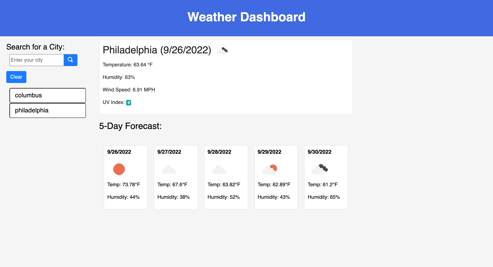

# Weather-Dashboard

## Description

This is an accurate weather application that provides an easy to read outlook of the current and future forecast for a desired location. The weather dashboard stores your recent search history for an easy way to reference back to different cities for planning your next adventure. Being able to quickly look up and save your favorite cities weather conditions is essential to planning for trips and what one may or may not need to pack for the week. The five day forcast displays the dates, icons, temps and humidity in a familiar card layout.

## Usage

1. Open the Weather Dashboard in your browser and bookmark for quick access.
2. Type your desired city in the input area and click search to view present and future weather conditions.
3. Refer to past searches by clicking a city in the recent search list.

## Mock-up

The following images show the web application's appearance and functionality:

[Deployed Application](https://djbalabis.github.io/Weather-Dashboard/)